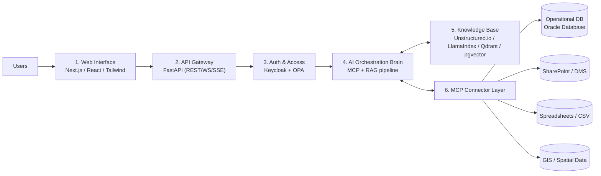
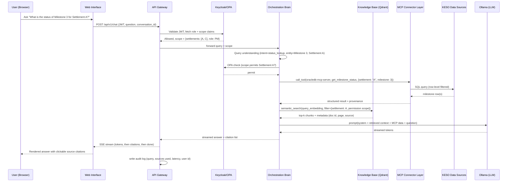

# 1. System Architecture

## 1.1 Overview

KESO AI is a layered RAG (Retrieval-Augmented Generation) system. A user's natural-language question passes through six layers before an answer is returned:

## 1.2 Layer responsibilities

### Layer 1 — Web Interface
- Stack: Next.js (App Router) + React + Tailwind CSS.
- Responsibilities: chat UI, Q&A history, search, rendering of source citations as clickable references, opening supporting records/documents in a viewer/modal, capturing thumbs-up/down + free-text feedback.
- Consumes: API Gateway REST endpoints for session/history management, SSE (or WebSocket) stream for token-by-token answer rendering.
- Auth: redirects to Keycloak for SSO (OIDC Authorization Code + PKCE flow); stores only the session cookie/short-lived access token, never long-lived credentials.

### Layer 2 — API Gateway
- Stack: FastAPI (Python 3.11+), served by Uvicorn/Gunicorn.
- Responsibilities:
  - Route and validate incoming requests (Pydantic models).
  - Terminate/validate JWTs issued by Keycloak (signature, expiry, audience).
  - Manage conversation session state (conversation id, message history reference, active filters e.g. project/settlement scope).
  - Stream responses to the client via Server-Sent Events (primary) or WebSocket (for bidirectional cases, e.g. mid-stream cancellation).
  - Rate limiting per user/role (token bucket, e.g. via `slowapi` or a Redis-backed limiter).
  - Emit structured audit events for every request (see [10-observability-audit.md](10-observability-audit.md)).
- Does **not** talk to the LLM or vector store directly — it delegates to the Orchestration Brain (Layer 4) as an internal service call.

### Layer 3 — Auth & Access
- Stack: Keycloak (SSO/IdP) + Open Policy Agent (OPA) (fine-grained policy decisions).
- Responsibilities:
  - SAML / OIDC login against KESO's identity source (or Keycloak-managed users for the PoC).
  - Issue JWT/OAuth2 access tokens carrying role and attribute claims (see [07-security-auth.md](07-security-auth.md)).
  - Role-based access control (RBAC) at the API/tool level (e.g., only Financial Officers may call payment-related MCP tools).
  - Row-level permission decisions (e.g., a PM can only see projects/settlements they are assigned to) delegated to OPA as a policy query from the API Gateway and from the Orchestration Brain before retrieval.

### Layer 4 — AI Orchestration Brain (MCP + RAG pipeline)
Four internal stages per query, implemented as a LangChain/LlamaIndex pipeline (or a custom orchestrator) that calls out to MCP servers and the vector store:

1. **Query understanding** — intent classification, entity extraction (project, settlement, milestone, date range, document type), query rewriting/expansion for retrieval (e.g., resolving "this project" from conversation context).
2. **MCP context fetch** — based on extracted entities/intent, call the relevant MCP server(s) (Layer 6) to fetch live, structured data (e.g., milestone status rows, claim/payment records) that complements or overrides stale vector-indexed content.
3. **Semantic retrieval** — vector similarity search against Qdrant/pgvector, filtered by the user's permission scope (settlement/project/document ACL tags) resolved in Layer 3.
4. **LLM answer + cite** — construct a grounded prompt (system instructions + retrieved chunks + MCP tool results + conversation history), call the LLM (Ollama-hosted Llama 3.1 or Mistral), post-process for citation mapping and guardrail checks (see [08-ai-safety-guardrails.md](08-ai-safety-guardrails.md)), then stream the answer back to Layer 2.

### Layer 5 — Knowledge Base
- Stack: Unstructured.io (extraction), LlamaIndex (ingestion/indexing orchestration), Qdrant (primary vector store) or PostgreSQL pgvector (alternative/fallback), sentence-transformers-compatible local embedding models.
- Responsibilities: offline/batch and incremental ingestion of PDF, DOCX, XLSX, CSV documents; cleaning and chunking; metadata tagging (source system, document type, project/settlement id, access tags, effective date); embedding generation; vector + metadata storage.
- See [06-rag-pipeline.md](06-rag-pipeline.md) for full ingestion pipeline design.

### Layer 6 — MCP Connector Layer
- Stack: Model Context Protocol (MCP) servers, one per data source family.
- Responsibilities: expose a uniform, tool-call interface (`list_tools`, `call_tool`) over each KESO data source, so the Orchestration Brain can fetch **live** data (not just what's in the vector index) without bespoke integration code per source.
- See [05-mcp-connectors.md](05-mcp-connectors.md) for per-connector tool specifications.

## 1.3 End-to-end request sequence

## 1.4 Non-functional requirements

| Attribute | Target for PoC |
|---|---|
| Answer latency (first token) | < 3s on mid-range server with 7–8B local LLM |
| Concurrent users | 10–20 concurrent sessions |
| Availability | Single-node, best-effort (PoC, not HA) |
| Data residency | 100% on-premises; no data leaves KESO network |
| Auditability | 100% of queries and cited sources logged |
| Extensibility | New data source = new MCP server, no core pipeline changes |
