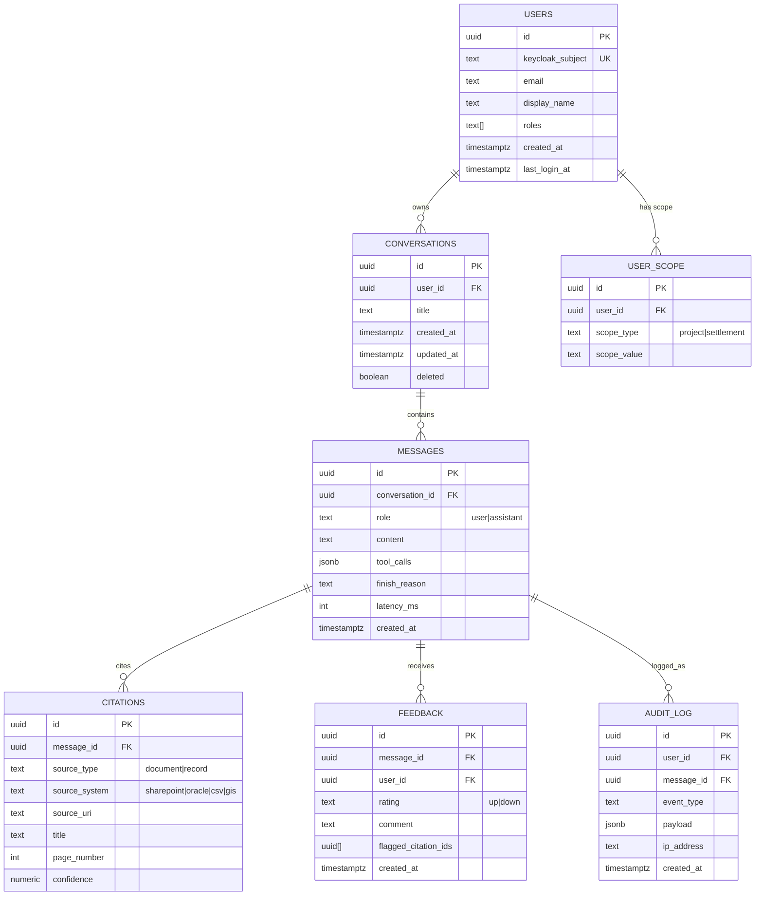

# 4. Data Model

KESO AI does not migrate or duplicate operational data. It maintains two categories of its own state:

1. **Application state** in PostgreSQL: conversations, messages, citations, feedback, audit log, user/permission cache.
2. **Retrieval index** in Qdrant (or pgvector): vectorized chunks of documents/records with metadata used for filtering.

Live operational facts (milestone status, payments, claims) are **not** duplicated into the app database — they are fetched at query time via the MCP Connector Layer (see [05-mcp-connectors.md](05-mcp-connectors.md)) so answers are never stale.

## 4.1 PostgreSQL schema (application state)



### Table notes

- `users.roles` mirrors Keycloak realm roles at time of last login (cache only — Keycloak/JWT remains the source of truth per-request; this cache is for admin reporting/UI display).
- `user_scope` mirrors row-level assignments (which projects/settlements a user may see), synced from the operational DB or from Keycloak group attributes on login; used as a fast local check before delegating final authorization to OPA.
- `messages.tool_calls` stores the MCP tool invocations made while answering, for auditability and debugging (tool name, args, duration, success/failure — not the raw returned data if it is sensitive; store a reference instead).
- `citations` is the durable record of "what did the assistant show as evidence", independent of the live source (which may change later) — supports the audit requirement "log cited sources."
- `audit_log.event_type` values: `query_submitted`, `answer_returned`, `answer_refused`, `citation_opened`, `feedback_submitted`, `permission_denied`, `guardrail_triggered`.

### Indexes / constraints (minimum)

- `conversations(user_id, updated_at desc)` for the conversation list endpoint.
- `messages(conversation_id, created_at)`.
- `citations(message_id)`.
- `audit_log(user_id, created_at)` and `audit_log(event_type, created_at)` for monitoring queries.
- Retention: `audit_log` and `citations` are append-only (no hard deletes) for compliance; `conversations`/`messages` support soft delete (`deleted` flag) at user request.

## 4.2 Vector store schema (Qdrant collection: `keso_documents`)

Each point (vector) represents one chunk of a source document or a serialized "record card" summarizing a structured row (for hybrid retrieval over both documents and DB records).

| Field | Type | Description |
|---|---|---|
| `id` | UUID | point id |
| `vector` | float[dim] | embedding (dim matches the configured embedding model, e.g. 768 for `nomic-embed-text`) |
| `text` | string (payload) | the chunk text passed to the LLM as context |
| `source_system` | string (payload) | `sharepoint`, `oracle`, `csv`, `gis` |
| `source_uri` | string (payload) | stable locator back to the origin (SharePoint item id, file path, DB row key) |
| `document_id` | string (payload) | groups chunks belonging to the same source document |
| `title` | string (payload) | document/record title |
| `doc_type` | string (payload) | `progress_report`, `policy`, `financial_tracker`, `claim`, `payment`, `map`, etc. |
| `project_id` | string (payload, indexed) | UISP project identifier, if applicable |
| `settlement_id` | string (payload, indexed) | settlement identifier, if applicable |
| `page_number` | int (payload) | for paginated documents |
| `effective_date` | datetime (payload) | document/report date, for recency ranking and date-range filters |
| `access_tags` | string[] (payload, indexed) | permission tags (e.g. `role:finance`, `settlement:A`) used for filtered ANN search |
| `chunk_hash` | string (payload) | dedup / re-ingestion idempotency key |
| `ingested_at` | datetime (payload) | last (re)ingestion timestamp |

Qdrant payload indexes should be created on `project_id`, `settlement_id`, `access_tags`, and `doc_type` to make permission-filtered search efficient (`must` filter combining user scope with the query filter).

If pgvector is used instead of Qdrant (lower-ops alternative), the same fields become columns/JSONB on a `document_chunks` table with a `vector` column (`pgvector` extension) and equivalent B-tree/GIN indexes on the filter columns.

## 4.3 Permission propagation into retrieval

1. On login, the API Gateway resolves the user's `roles` and `user_scope` (projects/settlements) from Keycloak claims (and/or the `user_scope` cache table).
2. The Orchestration Brain converts this into a Qdrant filter, e.g.:
   ```json
   {
     "must": [
       { "key": "settlement_id", "match": { "any": ["A", "C"] } },
       { "key": "access_tags", "match": { "any": ["role:pm"] } }
     ]
   }
   ```
3. This filter is applied server-side by Qdrant at search time — the LLM never sees chunks outside the user's scope, so it cannot leak them even if prompted to.
4. The same scope is passed to MCP tool calls (Layer 6), which enforce row-level SQL predicates (see [05-mcp-connectors.md](05-mcp-connectors.md) and [07-security-auth.md](07-security-auth.md)).
